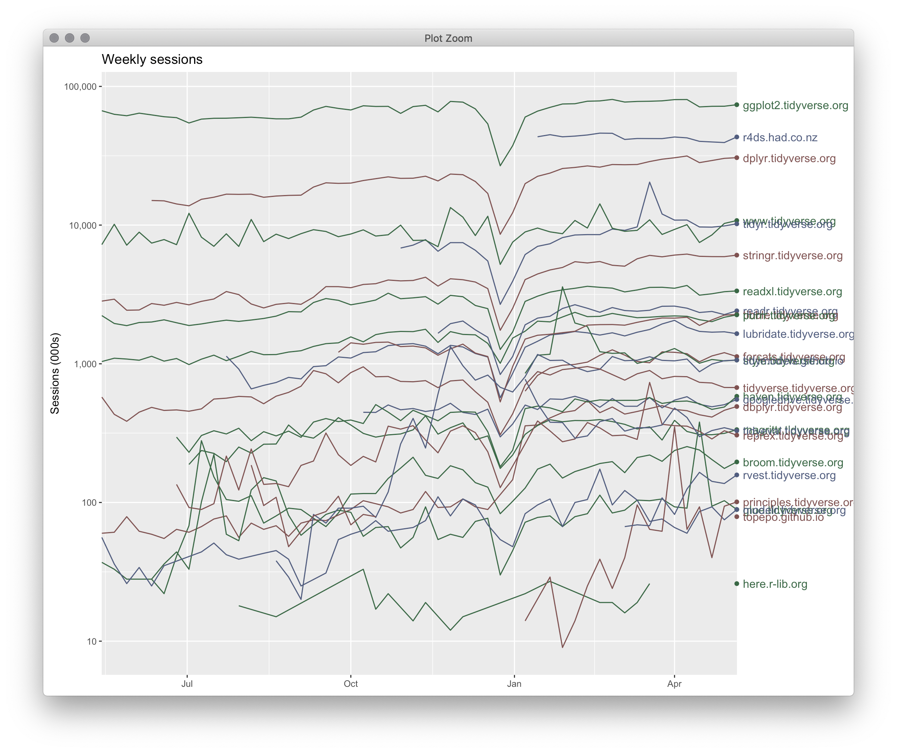
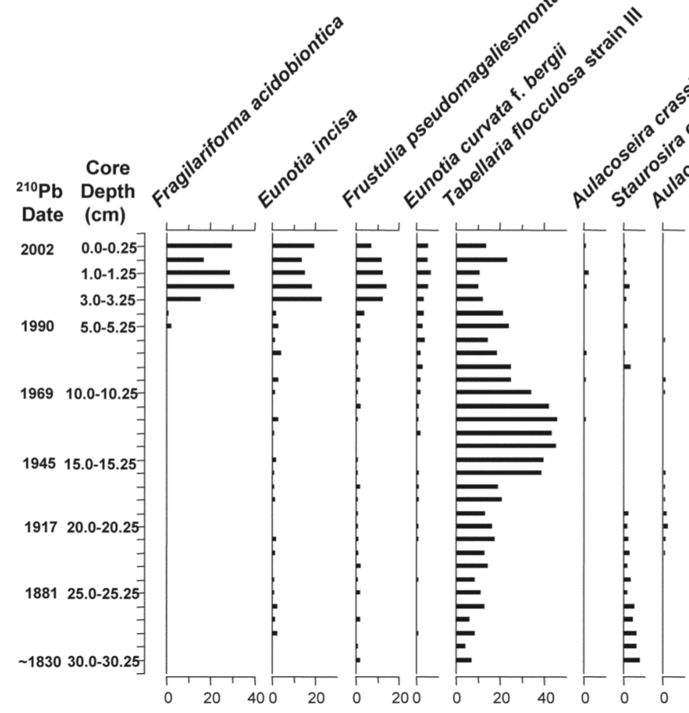
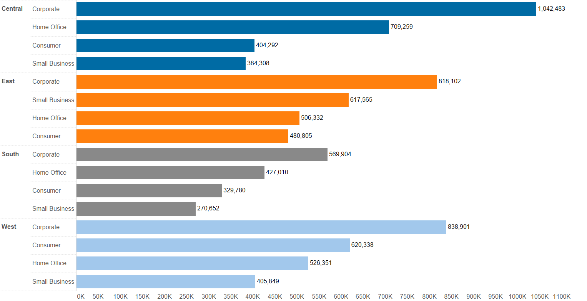
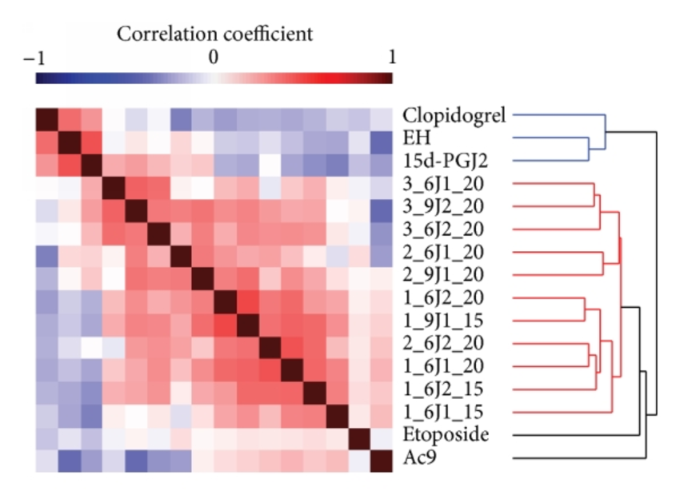

```{r, include = FALSE}
knitr::opts_chunk$set(
  collapse = TRUE,
  comment = "#>"
)
```

```{r setup}
library(ggplot2)
```

## Scales and guides

```{r}
p <- ggplot(
  mpg, 
  aes(class, cty, col = displ, shape = drv)
) + 
  geom_boxplot(aes(fill = drv)) +
  geom_point(position = position_jitterdodge(jitter.width = 0.2)) 
p
```

Scales:

- colour (continuous)
- fill (discrete)
- shape (discrete)
- **x (discrete)**
- **y (continuous)**

Guides:

- colour (`guide_colourbar()` with `position = "right"`)
- fill (`guide_legend()` with `position = "right"`)
- shape (`guide_legend()` with `position = "right"`, merged with fill guide)
- **x ("axis" guide with `position = "bottom"`)**
- **y ("axis" guide with with `position = "left"`)**
- **x and y ("grid" guide with with `position = "background"`)**

## Position guides and coordinate systems

```{r}
p + coord_polar()
```

Here, the position guides are:

- x ("clock" guide with `position = "foreground"`)
- y ("axis" guide with  `position = "left"`, with a transform applied in rescaled data space)\*
- x + y ("target" guide with `position = "background"`)

\* Scale-specific data spaces: untransformed data space, transformed data space, mapped data space, rescaled data space

## coord_trans()

```{r}
p + 
  coord_trans(y = "log10")
```

Here, the position guides are:

- x ("axis" guide with `position = "bottom"`)
- y ("axis" guide with `position = "left"` with a transformation applied in transformed data space)
- x + y ("grid" guide with `position = "background"`, with a transformation applied to "y" in transformed data space)

## Second axes

```{r}
p +
  scale_y_continuous(
    sec.axis = sec_axis(
      ~235.215 / ., 
      name = "L/100 km"
    )
  )
```

Here, the position guides are:

- x ("axis" guide with `position = "bottom"`)
- y ("axis" guide with `position = "left"`)
- y ("axis" guide with `position = "right"` with a transform applied in untransformed data space that calculates breaks and labels at draw time)
- x + y ("grid" guide with `position = "background"`)

## Things that ggplot2 might be able to do

### Smarter handling of overlappling labels

```{r}
p +
  scale_y_continuous(breaks = scales::extended_breaks(n = 100))
```

Could handle this by:

- dodging overlaps into multiple columns
- removing alternate labels (bisecting inwards...probably only makes sense for continuous scales)
- using a different `breaks` function depending on overlap (would make the primary axis kind of like a secondary axis, since it would calculate breaks at render time)

### Minor ticks

```{r}
p +
  annotate("text", x = -Inf, y = seq(12.5, 32.5, by = 5), label = "-", hjust = 1, size = 3) +
  coord_cartesian(clip = "off") +
  theme_classic()
```


### Manual specifiation of tick locations/labels

```{r}

```

Might be nice to specify in any of the scale data spaces...original data space here, but transformed data space for something calculated from the layers, mapped for something involving pre coordinate system transformation, or rescaled for putting something at the top/bottom/middle.

### Custom tick marks?

```{r}
p +
  annotate("point", x = -Inf, y = seq(10, 35, by = 5)) +
  coord_cartesian(clip = "off")
```

### Aesthetics applied to tick marks/labels

```{r}
ggplot(mpg, aes(class, hwy, col = class)) +
  geom_jitter()
```

### Multiple position guides on the same side of the plot?

```{r}

```

### Heiarchical scales/axis guides?

(need to find a better example) 

```{r}

```

### hclust scales/gudies?

```{r}

```


